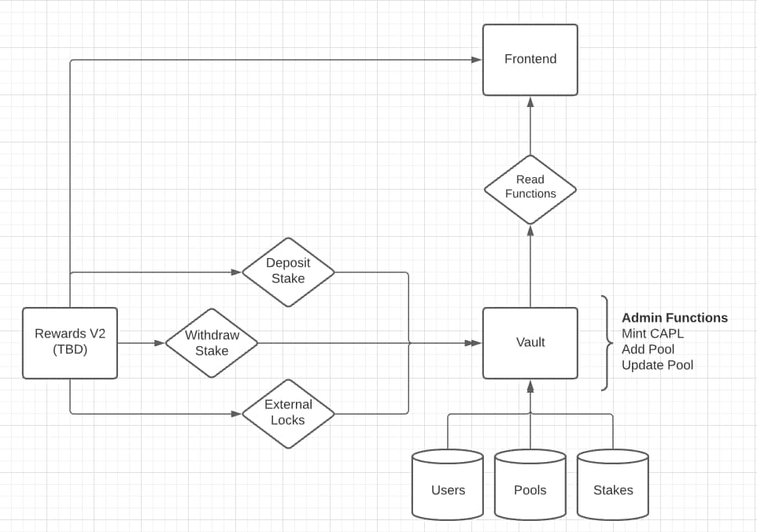

# cc-rewards-vault-contracts
rewards v2 &amp; vault contracts for the credit capital ecosystem

## Design
**Figure 1** shows a high level overview of the functionality associated with each contract. The goal here is to seperate the rewards logic, an evolving component of the system, and the definition of pools such that (hopefully) the vault contract does not need to be changed. You can think of the reward contract as the business layer and the vault contract as the persistance layer.



### Stake Definition
The stake struct represents a users position in a pool. A user can have multiple stakes in a single pool.
```
# subject to change
struct Stake {
    address lp;
    uint256 lpAmount;
    uint256 startBlock;
    uint256 lastClaimBlock;
    bool externalLock;
    bool active;
}
```

### Timelocks
Baked into the Stake struct is all of the logic required to calculate and read timelocks. All deposits into a given pool are subject to a one year timelock. However, a user that creates multiple deposits in a short amount of time should not be subject to multiple timelocks. If the user deposits multiple positions below the ``timelockThreshold`` (see contract) that deposit gets absorbed into the most recent position. Otherwise, a new position is created subject to its own, one year timelock.

### Pool Definition
```
# subject to change
struct Pool {
    uint256 totalRewards;           // TBD if this stays or we add more on chain analytics
    uint256 totalUsers;             // TBD if this stays or we add more on chain analytics
    uint256 averageRewardsPerUser;  // TBD if this stays or we add more on chain analytics
}
```

### User Defintion
```
# subject to change
struct User {
    uint256 pendingRewards;
    uint256 rewardDebt;     // house fee (?)
    uint256 claimedRewards;
    Stake[] stakes;
}
```

### Vault
The vault essentially has four responsabilities:
- Minting CAPL
- Managing Pools
- Managing Users
- Managing Stakes (external locks)

The first point is pretty straight forward. The vault will take ownership of the [CAPL](https://github.com/CreditCapital-io/CreditCapital-Contracts/blob/main/Deploy%201/CAPL.sol) token and be in charge of calling the mint function.

Managing pools involves exposing access controlled functions to create and update pools, as well as exposing public functions to read pools. See the contract for function definitions, parameters, and (eventually) implementation.

Managing Users involves tracking every participant in each pool, as well as (potentially) some on chain analytics about the lifetime stats of a user. The user struct definition also encompases all of the given users' stakes.

Managing stakes is responsible for recording a users position. This includes the lp token associated with the position, the position size, the release date (see external locking discussion above) and the last claim block for that specific position.

Besides the core functionality, the vault contract will need a role based access control [(RBAC)](https://docs.openzeppelin.com/contracts/2.x/api/access#Roles) mechanism for accessing restricted functions.

Staking will also need to be pausable at any time by an admin.

There also must be a way to remove the lp (via RBAC) in the case of emergencies.

Considerations for migrations are not taken into account here as that would defeat the purpose of this design.

