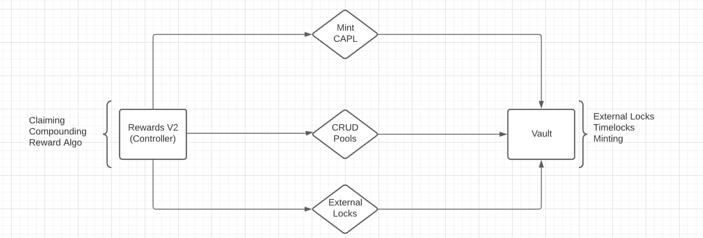

# cc-rewards-vault-contracts
rewards v2 &amp; vault contracts for the credit capital ecosystem

## Design
**Figure 1** shows a high level overview of the functionality associated with each contract. The goal here is to seperate the rewards logic, an evolving component of the system, and the definition of pools such that (hopefully) the vault contract does not need to be changed. You can think of the reward contract as the business layer and the vault contract as the persistance layer.



### Pool Definition
```
# subject to change
Pool {
    uint256 id,
    uint256 rewardRate,
    uint256 totalRewards
}
```

### User Defintion
```
# subject to change
User {
    uint256 pendingRewards,
    uint256 claimedRewards,
    uint256 timeLockExpirationDate,
    bool externalLock,
    uint256 lastClaimTime
}
```

### Vault
The vault essentially has four responsabilities:
- Minting CAPL
- Managing Pools
- Managing Users
- Managing external Locks

The first point is pretty straight forward. The vault will take ownership of the [CAPL](https://github.com/CreditCapital-io/CreditCapital-Contracts/blob/main/Deploy%201/CAPL.sol) token and be in charge of calling the mint function.

Managing pools involves exposing access controlled functions to create and update pools, as well as exposing public functions to read pools. The functions are defined below:

-   ``createPool() external onlyAdmins``
-   ``readPool() external onlyAdmins``
-   ``updatePool() external onlyAdmins``

Managing external locks is responsible for setting an external lock in the pool structure as well as a read function to read this value.

-   ``setTimeLock() external onlyAdmins``
-   ``readTimeLock() external onlyAdmins``

Besides the core functionality, the vault contract will need a role based access control [(RBAC)](https://docs.openzeppelin.com/contracts/2.x/api/access#Roles) mechanism for accessing restricted functions.

Staking will also need to be pausable at any time by an admin.

