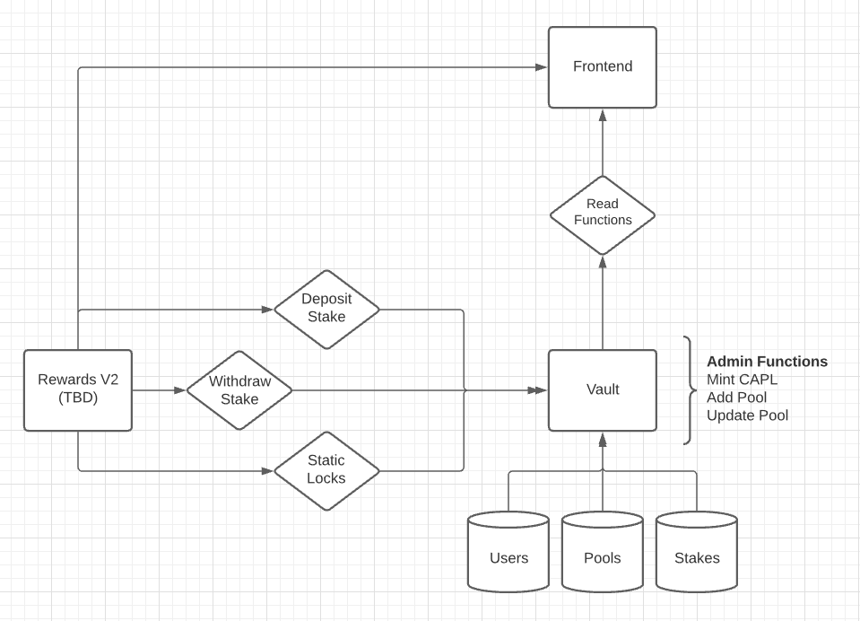

# Credit Capital Rewards (v2) system

### Docs
Check out the documentation in the folders in ``contracts`` folder for documentation on each contract.

### Design illustration

**Figure 1** shows a high level overview of the functionality associated with the vault specifically. The goal here is to seperate the rewards logic, an evolving component of the system, and the definition of pools, users, and stakes such that (hopefully) the vault contract does not need to be changed. You can think of the reward contract as the business layer and the vault contract as the persistance layer.

